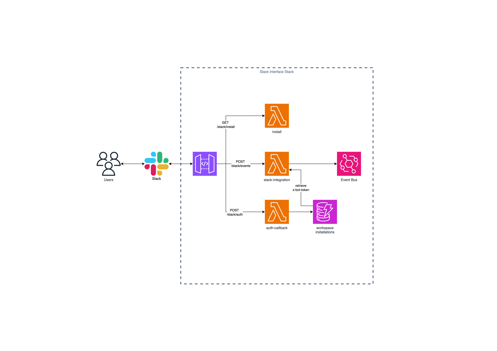

# Slack Application Template

## Overview

This repository serves as a template for building a Slack applications using serverless event-driven architectures on AWS. The template covers the basic auth set up for multi workspace deployments and how to handle different Slack events.

## Architecture

The architecture of the application is as follows:

## Setup & Deployment

### Prerequisites

- AWS account
- Slack account with permissions to create apps in the workspace
- Node.js and pnpm installed
- AWS CLI installed and configured

### Configuring Slack App

1. Create a Slack app by following the [Slack API Hello World tutorial](https://api.slack.com/tutorials/hello-world-bolt)
2. Copy and past the manifest file from the `slack-app-manifest.json` file in this repository to the app settings.
3. Note the `SLACK_CLIENT_ID`, `SLACK_CLIENT_SECRET` and the `SLACK_SIGNING_SECRET` from the Slack app settings.

### Deploying the Backend

1. Clone this repository.
2. Navigate to the cloned directory and then to the **services/slack-interface** directory.
3. Run `pnpm install` to install dependencies.
4. Have your aws credentials configured in your environment.
5. Deploy the application using using the command `pnpm ci:deploy -c stage=dev`.
6. Note the api endpoint from the output of the deployment.

### Linking Slack App to Backend

1. In the App Manifest file, update the <api-endpoint> with the actual API endpoint.
2. To install the app to your workspace, visit the site `<api-endpoint>/slack/install` in your browser. You will be redirected to Slack to authorize the app.

## Usage

Copy this repository to your own repository and start building your own Slack application. The template provides a basic structure for handling Slack events and commands.

## Contributing

Contributions are welcome! Feel free to open issues or submit pull requests to enhance the functionality of this Slack application.

## Authors

- **Andre du Plessis** - _Initial work_ - [jaduplessis](https://github.com/jaduplessis)

---

Enjoy building your event-driven Slack applications!

---
